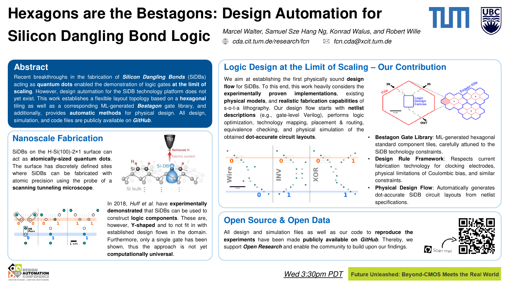

# Hexagons are the Bestagons: Design Automation for Silicon Dangling Bond Logic

<p align="center">
  <picture>
    <source media="(prefers-color-scheme: dark)" srcset="logo/mnt_light.svg" width="60%">
    
  </picture>
</p>

This repository provides supplementary data for the paper *Hexagons are the Bestagons: Design Automation for Silicon
Dangling Bond Logic* by M. Walter, S. S. H. Ng, K. Walus, and R. Wille published in DAC 2022.

You can find a video recording of the DAC 2022 presentation [on YouTube](https://youtu.be/3D8D6IPMHhM) and
[an overview poster](./poster/thumbnail.png) in this repository.

<p align="center">
  <a href="https://youtu.be/3D8D6IPMHhM">
  
  </a>
  &nbsp; &nbsp; &nbsp;
  <a href="./poster/poster.pdf">
  
  </a>
</p>

## SiDB *Bestagon* Gates

All of the gates proposed as part of the *Bestagon* gate library are included in the `bestagon-gates` directory.
Sub-directories follow a naming convention of `NiMo_G[_O]` where `N` denotes the count of inputs, `M` the count of
outputs, `G` the logic type implemented, and `_O` an optional suffix denoting the orientation of the gate. For
example, `2i1o_nand` refers to a 2-input 1-output NAND logic gate.

Inside each subdirectory, the following files are included:

* One or more `*.sqjx.zip` files containing the simulation results of all logic input permutations which you can
  visualize in SiQAD by navigating to File, Import Past Results
* One or more `*.svg` files containing a vector graphics screenshot of all logic input permutations which you can open
  in Inkscape or other vector graphics editors/viewers
* One `*.sqd` design file which you can open in SiQAD

The following gates are designed by a reinforcement learning
agent ([arXiv reference](https://arxiv.org/abs/2204.06288)):

* `1i2o_fo2` (fanout)
* `2i1o_and`
* `2i1o_nand`
* `2i1o_nor`
* `2i1o_or`
* `2i1o_xnor`
* `2i2o_cx`
* `2i2o_ha`

The following gates are manually designed:

* `1i1o_inv_diag`
* `1i1o_inv_straight`
* `1i1o_wire_diag`
* `1i1o_wire_straight`
* `2i2o_hourglass` (two wires running top to down in parallel)

## Experimental Evaluation: Physical Design of SiDB Layouts

The `experiments` folder contains all layout files obtained by the physical design process laid out in the paper as well
as a C++ code file that implements the algorithm to reproduce said data via the FCN framework
[*fiction*](https://github.com/marcelwa/fiction).

### Source code: `bestagon.cpp`

The C++ code that implements the physical design algorithm presented in the paper. It utilizes the FCN framework
[*fiction*](https://github.com/marcelwa/fiction). To compile it, place the file in *fiction*'s `experiments`
folder and call CMake with the `-DFICTION_EXPERIMENTS=ON` flag.

To learn more, see *fiction*'s
[documentation on how to build experiments](https://fiction.readthedocs.io/en/latest/getting_started.html#building-experiments).

### Raw data: `bestagon.json`

When running the binary that results from compiling `bestagon.cpp`, a `bestagon.json` file is created (as well as a
directory with layout files, see below). This file contains extensive experimental data in JSON format together with a
Git commit tag that points towards the version it was compiled with. The file existing in this repo points towards a tag
in *fiction*'s repo.

### Formatted data: `bestagon.csv`

An excerpt from `bestagon.json` that was presented in Table I of the paper.

### Circuit layouts: `layouts/`

A directory that contains dot-accurate SiDB layouts generated by the compiled `bestagon.cpp`. The layouts are present
in `SQD` format that is used by the SiDB CAD tool [*SiQAD*](https://github.com/siqad/siqad). Utilizing this tool, the
circuit layouts' behavior can be validated by physical simulations.

The respective logic networks that were used as specification for the physical design process were taken from

*A Placement and Routing Algorithm for Quantum-dot Cellular Automata* by A. Trindade et al. in SBCCI
2016 ([IEEE Xplore](https://ieeexplore.ieee.org/abstract/document/7724048))

and

*Placement and Routing by Overlapping and Merging QCA Gates* by G. Fontes et al. in ISCAS
2018 ([IEEE Xplore](https://ieeexplore.ieee.org/document/8351001)).

These networks are established benchmarks in the domain of FCN technologies and
are [available as Verilog files](https://github.com/marcelwa/fiction/tree/main/benchmarks) in
*fiction*'s experiment sandbox.

## Reference

Please find the paper in the [ACM Digital Library](https://dl.acm.org/doi/10.1145/3489517.3530525).

In case you are using the *Bestagon* gate library in your work, we would be thankful if you referred to it by citing the
following publication:

```bibtex
@inproceedings{walter2022hexagons,
  title={{Hexagons are the Bestagons: Design Automation for Silicon Dangling Bond Logic}},
  author={Walter, Marcel and Ng, Samuel Sze Hang and Walus, Konrad and Wille, Robert},
  booktitle={Design Automation Conference (DAC)},
  pages = {739--744},
  year={2022}
}
```
